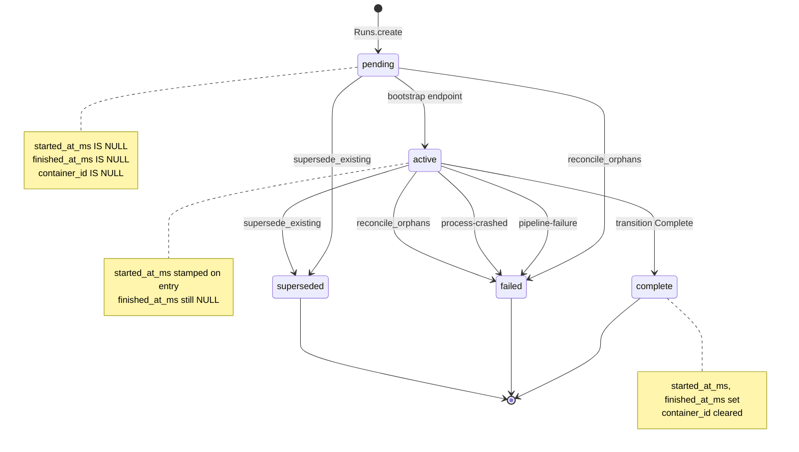
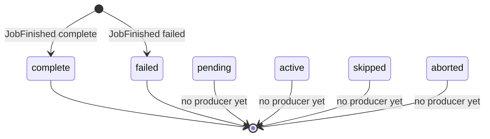
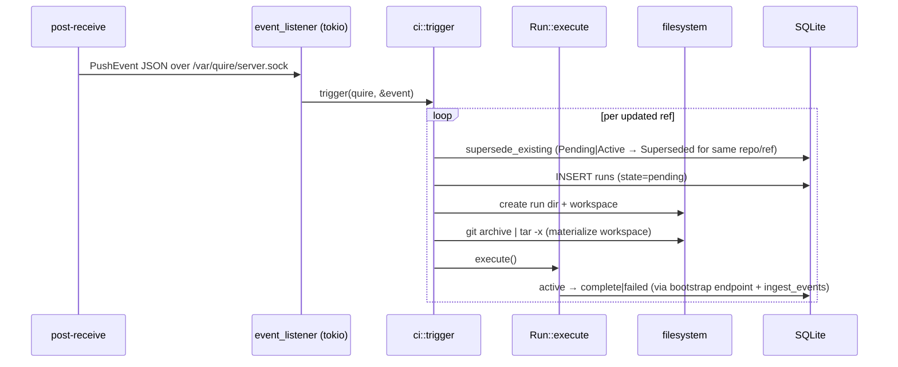

# quire — CI state machines

A reader's guide to the two state machines that govern a CI run, paired with what the code actually writes today vs. what the schema and `CI.md` describe. `CI.md` is the architectural design; this doc is the lifecycle inside that design.

There are two machines:

1. **Run state** — the row in `runs`. One per `(repo, ref, push)`.
2. **Job state** — the row in `jobs`. One per job inside a run.

A run owns its jobs; jobs FK on `(run_id, job_id)` and cascade delete.

## Run state machine

### Diagram



### Transitions in code

| From → To | Where | When | `failure_kind` |
| --- | --- | --- | --- |
| `[*] → pending` | `Runs::create` (`quire-server/src/ci/run.rs:103`) | A push event arrives and a `runs` row is inserted. | — |
| `pending → active` | Bootstrap endpoint (`api.rs`), called when `quire-ci` fetches bootstrap data | `quire-ci` connects to the server and marks the run active. Stamps `started_at_ms`. | — |
| `active → complete` | `Run::transition`, called from `Run::execute` | `quire-ci` exited 0 and `RunFinished { outcome: Success }` was ingested. Stamps `finished_at_ms`, clears `container_id`. | — |
| `active → failed` | `Run::execute` | `quire-ci` exited 0 and `RunFinished { outcome: PipelineFailure }` was ingested — a job's run-fn returned an error. | `"pipeline-failure"` |
| `active → failed` | `Run::execute` | `quire-ci` exited non-zero, or exited 0 but emitted no `RunFinished` event (process crash or panic). | `"process-crashed"` |
| `{pending, active} → superseded` | `Runs::supersede_existing` (`run.rs:155`) via raw SQL, **bypassing `transition`** | A new `Runs::create` for the same `(repo, ref)` arrived. Pending rows are flipped directly; active rows have their container killed (`docker kill`) first. | — |
| `{pending, active} → failed` | `reconcile_orphans` (`run.rs:205`) via raw SQL, **bypassing `transition`** | Startup-time cleanup of rows left behind by a previous `quire serve` instance. | `"orphaned"` |

`Run::transition(to, failure_kind)`'s allowed-transition match:

```
(Pending, Active) | (Pending, Complete) | (Pending, Superseded) |
(Active,  Complete) | (Active,  Failed) | (Active,  Superseded)
```

In practice only `(Active, Complete)` and `(Active, Failed)` are exercised via `transition` — the `Pending → Active` edge is owned by the bootstrap endpoint (api.rs), and the supersede edges go through raw SQL (`supersede_existing`), not `transition`. The other edges are gated for defensive consistency, in case a future caller routes supersede through the typed API. Anything else — `Pending → Failed`, `Active → Pending`, or any transition out of a terminal state — returns `InvalidTransition`.

`failure_kind` is recorded only when `to == Failed`; it's ignored for `Active`, `Complete`, and `Superseded`.

### Database invariants

The DB enforces shape per state via a `CHECK` constraint in `migrations/0001_initial.sql`:

| State | `started_at_ms` | `finished_at_ms` | `container_id` |
| --- | --- | --- | --- |
| `pending` | NULL | NULL | NULL |
| `active` | set | NULL | (any) |
| `complete` | set | set | NULL |
| `failed` | (any) | set | NULL |
| `superseded` | (any) | set | NULL |

Plus monotonicity: `started_at_ms >= queued_at_ms`, `finished_at_ms >= started_at_ms`. `started_at_ms`, `finished_at_ms`, and `failure_kind` are stamped at most once each, via `COALESCE` in the `UPDATE`.

### `failure_kind`

Nullable column populated by `Run::transition` when entering `Failed`, plus `reconcile_orphans` (raw SQL). Each transition sets it at most once via `COALESCE`. The values written today:

| Value | Producer |
| --- | --- |
| `"pipeline-failure"` | `Run::execute`: `quire-ci` exited 0 and reported `RunFinished { outcome: PipelineFailure }` — a job's run-fn returned an error. Compile errors in `ci.fnl` also produce this outcome (quire-ci emits `RunFinished(PipelineFailure)` and exits 0). |
| `"process-crashed"` | `Run::execute`: `quire-ci` exited non-zero, or exited 0 but never emitted a `RunFinished` event (panic or unexpected termination). |
| `"orphaned"` | `reconcile_orphans` on startup. |

Successful and superseded runs leave `failure_kind` NULL. The set is open — UI consumers should not assume it's exhaustive.

## Job state machine

### Diagram



### Transitions in code

There is only one writer of `jobs` rows: `Run::ingest_events` (`run.rs:399`). It reads `events.jsonl` after the `quire-ci` subprocess exits and, for each `JobStarted`/`JobFinished` pair, inserts **one row directly in the terminal state**. The intermediate `active` state is held in an in-memory `pending_jobs` map during ingest and never persisted.

| From → To | Where | When |
| --- | --- | --- |
| `[*] → complete` | `Run::ingest_events` (`run.rs:399`) | `JobFinished { outcome: complete }` paired with a buffered `JobStarted`. |
| `[*] → failed` | `Run::ingest_events` | `JobFinished { outcome: failed }` paired with a buffered `JobStarted`. |

Consequence: while `quire-ci` is running, **no `jobs` rows exist for this run**. They all materialize at ingest time. Live progress is visible via `events.jsonl` or per-`sh` log files on disk, not via SQL.

### Database invariants

`migrations/0001_initial.sql` allows six job states (`pending`, `active`, `complete`, `failed`, `skipped`, `aborted`) with these shape rules:

| State | `started_at_ms` | `finished_at_ms` |
| --- | --- | --- |
| `pending` | NULL | NULL |
| `active` | set | NULL |
| `complete` | set | set |
| `failed` | set | set |
| `skipped` | NULL | set |
| `aborted` | (any) | set |

`skipped` carries `finished_at_ms` but not `started_at_ms` — the row exists to record "this job never ran" with a timestamp anchoring it to the run.

### Stop-on-first-failure inside `quire-ci`

The subprocess's executor (`quire-ci/src/main.rs`) breaks out of the topo-order loop on the first job error:

```rust
if let Err(e) = result {
    failed_job = Some((job_id.clone(), e));
    break;
}
```

`JobStarted`/`JobFinished` are only emitted for jobs that actually ran. **Jobs downstream of the failure produce no events, so no `jobs` row at all** — not `skipped`, not anything. See Gaps below.

## Event flow: Process executor

`Executor::Process` is the only executor today. The orchestrator shells out to the `quire-ci` binary and ingests events afterward, rather than driving the runtime in-process:


Wire events (`quire-core/src/ci/event.rs`):

* `JobStarted { job_id }`
* `JobFinished { job_id, outcome: complete | failed }` — `JobOutcome` is the closed set, not the full job-state enum.
* `ShStarted { job_id, cmd }` / `ShFinished { job_id, exit_code }`

`Run::ingest_events` reads the file in two passes (jobs first to satisfy the FK on `(run_id, job_id)`, then sh_events). Ingest failures are logged but never demote the run's own outcome — a partial DB write is preferable to losing the pass/fail signal.

## Orchestration today

The lifecycle from push to run start:



Two things in `CI.md` that the code does *not* yet implement at this layer:

* **Queue + Notify wakeup.** `CI.md` describes a separate runner task pulled from a SQLite queue via `tokio::sync::Notify`. Today `ci::trigger` is called **synchronously** on the listener's tokio task — one push at a time, no queue, no separate runner. Max-concurrency-1 falls out of this trivially, but it isn't the architecture in `CI.md`.
* **Per-run container.** `CI.md` says `docker run` at run start, `docker exec` per `(sh …)`, `docker stop` at end. `quire-ci` invokes `(sh …)` directly on the host process; the `container_id` column is unused by the current executor and read only by `supersede_existing` (which calls `docker kill` if it's set).

## Schema column inventory

A column-by-column map of what's live vs. dead weight with the current Process executor. "Dead" means no code path writes a non-NULL value **and** no code path reads it back, or writes it but nothing reads it.

### `runs` table

| Column | Written by | Read by | Status |
| --- | --- | --- | --- |
| `id` | `Runs::create` | everywhere | **live** |
| `repo` | `Runs::create` | `supersede_existing`, web handlers | **live** |
| `ref_name` | `Runs::create` | `supersede_existing`, web handlers, bootstrap response | **live** |
| `sha` | `Runs::create` | `read_meta`, bootstrap response, web handlers | **live** |
| `pushed_at_ms` | `Runs::create` | `read_meta`, web handlers | **live** |
| `state` | `Runs::create` (→ `pending`) + every transition | everywhere | **live** |
| `failure_kind` | `Run::transition(Failed, …)`, `reconcile_orphans` | web handlers | **live** |
| `queued_at_ms` | `Runs::create` | web handlers | **live** |
| `started_at_ms` | `transition(Active)`, also stamped as fallback in `Complete/Failed/Superseded` | `read_started_at`, web handlers | **live** |
| `finished_at_ms` | `transition(Complete/Failed/Superseded)` | `read_finished_at`, web handlers | **live** |
| `run_token` | `Runs::create` (API sessions only) | `verify_run_token` middleware | **live** |
| `git_dir` | `Run::store_bootstrap_data` (API sessions only) | bootstrap endpoint | **live** |
| `traceparent` | `Run::store_bootstrap_data` (API sessions only) | bootstrap endpoint | **live** |
| `container_id` | nothing (always inserted/cleared as `NULL`) | `supersede_existing` checks it before calling `docker kill`, then clears it on supersede | **dead** — always NULL with the Process executor; the read-and-clear is a hook for a future Docker executor that never shipped |
| `workspace_path` | `Runs::create` (hardcoded in test helpers too) | nothing reads it back | **dead** — the runtime reconstructs the path as `<base_dir>/<run_id>/workspace` from config + ID |
| `image_tag` | nothing (always `NULL`) | nothing | **dead** — Docker executor placeholder |
| `build_started_at_ms` | nothing (always `NULL`) | nothing | **dead** — Docker executor placeholder |
| `build_finished_at_ms` | nothing (always `NULL`) | nothing | **dead** — Docker executor placeholder |
| `container_started_at_ms` | nothing (always `NULL`) | nothing | **dead** — Docker executor placeholder |
| `container_stopped_at_ms` | nothing (always `NULL`) | nothing | **dead** — Docker executor placeholder |
| `sentry_trace_id` | nothing (added in migration 0004, never written) | nothing | **dead** — superseded by `traceparent` (migration 0006) before the column was ever used |

The five `image_tag` / `build_*` / `container_{started,stopped}_at_ms` columns and `sentry_trace_id` are pure schema debt — they were added speculatively for a Docker executor that was never implemented. `container_id` and `workspace_path` are written but never read back by live code paths, so they are candidates for removal as well.

### `jobs` table

All six columns (`run_id`, `job_id`, `state`, `exit_code`, `started_at_ms`, `finished_at_ms`) are written by `Run::ingest_events` and read by the web detail view. All **live**.

The schema permits six states (`pending`, `active`, `complete`, `failed`, `skipped`, `aborted`) but `ingest_events` only writes `complete` and `failed`. The other four states have no producer today — see Gaps below.

### `sh_events` table

All columns (`run_id`, `job_id`, `started_at_ms`, `finished_at_ms`, `exit_code`, `cmd`) are written by `Run::ingest_events` (pass 2) and read by the web detail view. All **live**.

## Gaps

States the schema admits — or `CI.md` commits to — that no code path produces today:

| Gap | Schema/spec | Producer needed |
| --- | --- | --- |
| Job `active` rows during execution | Schema-allowed | `ingest_events` inserts one row per job at JobFinished time. While `quire-ci` is running, the `jobs` table has nothing for this run. Live UI of "currently running job" needs an active-row writer — either eager ingest, or a separate writer inside `quire-ci`. |
| Job `pending` rows | Schema-allowed | Useful for "queued jobs in topo order" UI. Today jobs go straight from no-row to a terminal row. |
| Job `skipped` rows for dependents of a failed job | Schema-allowed | `quire-ci`'s loop `break`s on first failure and emits no events for downstream jobs. To populate `skipped`, either `quire-ci` would emit `JobSkipped` events for unrun topo-order jobs, or the ingester would compute them from the pipeline graph + the surviving JobFinished rows. |
| Job `aborted` rows | Schema-allowed | Needed when a run is killed mid-flight — e.g. by `supersede_existing` `docker kill`-ing the container. Today the run row flips to `superseded`, but no `jobs` rows are written for the work that was in flight. |
| `:allow-failure` job flag | Documented in `CI.md` as v1 | Not implemented anywhere in `quire-core`, `quire-ci`, or `quire-server`. The structural validator doesn't recognize the key; the executor treats every job error as fatal. |
| Queue + Notify wakeup | `CI.md` "Communication" section | `trigger` runs synchronously on the listener task. No queue scan, no Notify, no separate runner task. |

## Cross-references

* Architecture and rationale: [`CI.md`](./CI.md).
* Pipeline DSL: [`CI-FENNEL.md`](./CI-FENNEL.md).
* DB shape: [`quire-server/migrations/0001_initial.sql`](../quire-server/migrations/0001_initial.sql).
* Code: `quire-server/src/ci/run.rs`, `quire-server/src/ci/mod.rs`, `quire-core/src/ci/event.rs`, `quire-ci/src/main.rs`.
