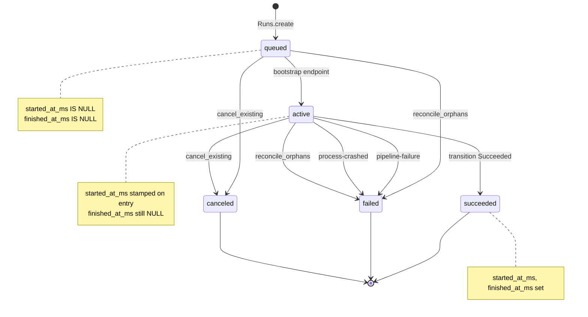
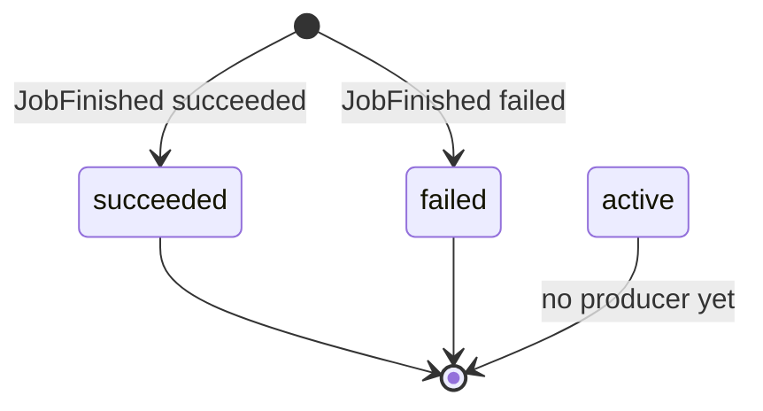
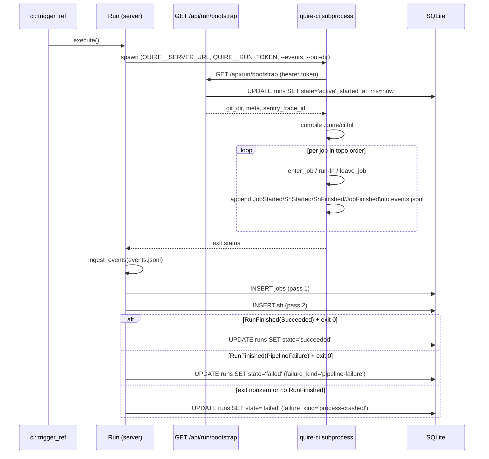
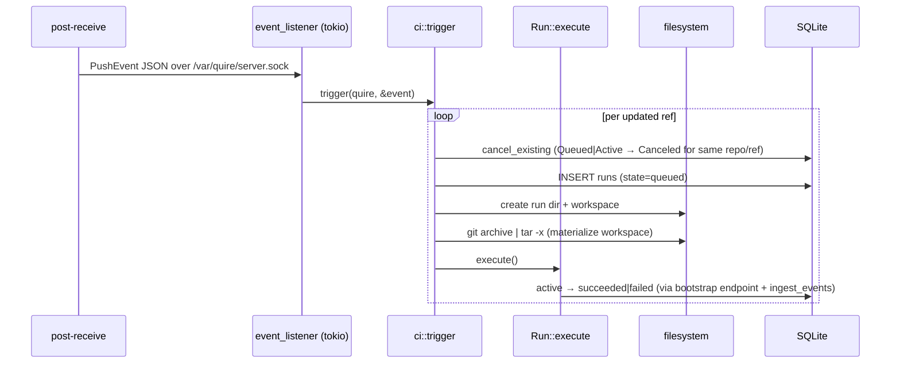

# quire — CI state machines

A reader's guide to the two state machines that govern a CI run, paired with what the code actually writes today vs. what the schema and `CI.md` describe. `CI.md` is the architectural design; this doc is the lifecycle inside that design.

There are two machines:

1. **Run state** — the row in `runs`. One per `(repo, ref, push)`.
2. **Job state** — the row in `jobs`. One per job inside a run.

A run owns its jobs; jobs FK on `(run_id, job_id)` and cascade delete.

## Run state machine

### Diagram



### Transitions in code

| From → To | Where | When | `failure_kind` |
| --- | --- | --- | --- |
| `[*] → queued` | `Runs::create` (`quire-server/src/ci/run.rs`) | A push event arrives and a `runs` row is inserted. | — |
| `queued → active` | Bootstrap endpoint (`api.rs`), called when `quire-ci` fetches bootstrap data | `quire-ci` connects to the server and marks the run active. Stamps `started_at_ms`. | — |
| `active → succeeded` | `Run::transition`, called from `Run::execute` | `quire-ci` exited 0 and `RunFinished { outcome: Succeeded }` was ingested. Stamps `finished_at_ms`. | — |
| `active → failed` | `Run::execute` | `quire-ci` exited 0 and `RunFinished { outcome: PipelineFailure }` was ingested — a job's run-fn returned an error. | `"pipeline-failure"` |
| `active → failed` | `Run::execute` | `quire-ci` exited non-zero, or exited 0 but emitted no `RunFinished` event (process crash or panic). | `"process-crashed"` |
| `{queued, active} → canceled` | `Runs::cancel_existing` via raw SQL, **bypassing `transition`** | A new `Runs::create` for the same `(repo, ref)` arrived. Both queued and active rows are flipped directly. | — |
| `{queued, active} → failed` | `reconcile_orphans` via raw SQL, **bypassing `transition`** | Startup-time cleanup of rows left behind by a previous `quire serve` instance. | `"orphaned"` |

`Run::transition(to, failure_kind)`'s allowed-transition match:

```
(Queued, Active) | (Queued, Succeeded) | (Queued, Canceled) |
(Active, Succeeded) | (Active, Failed) | (Active, Canceled)
```

In practice only `(Active, Succeeded)` and `(Active, Failed)` are exercised via `transition` — the `Queued → Active` edge is owned by the bootstrap endpoint (api.rs), and the cancel edges go through raw SQL (`cancel_existing`), not `transition`. The other edges are gated for defensive consistency, in case a future caller routes cancellation through the typed API. Anything else — `Queued → Failed`, `Active → Queued`, or any transition out of a terminal state — returns `InvalidTransition`.

`failure_kind` is recorded only when `to == Failed`; it's ignored for `Active`, `Succeeded`, and `Canceled`.

### Database invariants

The DB enforces shape per state via a `CHECK` constraint (see `migrations/0009_rename_ci_vocab.sql`):

| State | `started_at_ms` | `finished_at_ms` |
| --- | --- | --- |
| `queued` | NULL | NULL |
| `active` | set | NULL |
| `succeeded` | set | set |
| `failed` | (any) | set |
| `canceled` | (any) | set |

Plus monotonicity: `started_at_ms >= queued_at_ms`, `finished_at_ms >= started_at_ms`. `started_at_ms`, `finished_at_ms`, and `failure_kind` are stamped at most once each, via `COALESCE` in the `UPDATE`.

### `failure_kind`

Nullable column populated by `Run::transition` when entering `Failed`, plus `reconcile_orphans` (raw SQL). Each transition sets it at most once via `COALESCE`. The values written today:

| Value | Producer |
| --- | --- |
| `"pipeline-failure"` | `Run::execute`: `quire-ci` exited 0 and reported `RunFinished { outcome: PipelineFailure }` — a job's run-fn returned an error. Compile errors in `ci.fnl` also produce this outcome (quire-ci emits `RunFinished(PipelineFailure)` and exits 0). |
| `"process-crashed"` | `Run::execute`: `quire-ci` exited non-zero, or exited 0 but never emitted a `RunFinished` event (panic or unexpected termination). |
| `"orphaned"` | `reconcile_orphans` on startup. |

Succeeded and canceled runs leave `failure_kind` NULL. The set is open — UI consumers should not assume it's exhaustive.

## Job state machine

### Diagram



### Transitions in code

There is only one writer of `jobs` rows: `Run::ingest_events`. It reads `events.jsonl` after the `quire-ci` subprocess exits and, for each `JobStarted`/`JobFinished` pair, inserts **one row directly in the terminal state**. The intermediate `active` state is held in an in-memory `inflight_jobs` map during ingest and never persisted.

| From → To | Where | When |
| --- | --- | --- |
| `[*] → succeeded` | `Run::ingest_events` | `JobFinished { outcome: succeeded }` paired with a buffered `JobStarted`. |
| `[*] → failed` | `Run::ingest_events` | `JobFinished { outcome: failed }` paired with a buffered `JobStarted`. |

Consequence: while `quire-ci` is running, **no `jobs` rows exist for this run**. They all materialize at ingest time. Live progress is visible via `events.jsonl` or per-`sh` log files on disk, not via SQL.

### Database invariants

`migrations/0009_rename_ci_vocab.sql` allows three job states (`active`, `succeeded`, `failed`) with these shape rules:

| State | `started_at_ms` | `finished_at_ms` |
| --- | --- | --- |
| `active` | set | NULL |
| `succeeded` | set | set |
| `failed` | set | set |

### Stop-on-first-failure inside `quire-ci`

The subprocess's executor (`quire-ci/src/main.rs`) breaks out of the topo-order loop on the first job error:

```rust
if let Err(e) = result {
    failed_job = Some((job_id.clone(), e));
    break;
}
```

`JobStarted`/`JobFinished` are only emitted for jobs that actually ran. **Jobs downstream of the failure produce no events, so no `jobs` row at all.** See Gaps below.

## Event flow: Process executor

`Executor::Process` is the only executor today. The orchestrator shells out to the `quire-ci` binary and ingests events afterward, rather than driving the runtime in-process:



Wire events (`quire-core/src/ci/event.rs`):

* `JobStarted { job_id }`
* `JobFinished { job_id, outcome: succeeded | failed }` — `JobOutcome` is the closed set, not the full job-state enum.
* `ShStarted { job_id, cmd }` / `ShFinished { job_id, exit_code }`

`Run::ingest_events` reads the file in two passes (jobs first to satisfy the FK on `(run_id, job_id)`, then sh). Ingest failures are logged but never demote the run's own outcome — a partial DB write is preferable to losing the pass/fail signal.

## Orchestration today

The lifecycle from push to run start:



Two things in `CI.md` that the code does *not* yet implement at this layer:

* **Queue + Notify wakeup.** `CI.md` describes a separate runner task pulled from a SQLite queue via `tokio::sync::Notify`. Today `ci::trigger` is called **synchronously** on the listener's tokio task — one push at a time, no queue, no separate runner. Max-concurrency-1 falls out of this trivially, but it isn't the architecture in `CI.md`.
* **Per-run container.** `CI.md` says `docker run` at run start, `docker exec` per `(sh …)`, `docker stop` at end. `quire-ci` invokes `(sh …)` directly on the host process. The Docker-executor schema columns (`container_id`, `image_tag`, build/container timestamps) have been removed in migration 0007.

## Schema column inventory

### `runs` table

| Column | Written by | Read by |
| --- | --- | --- |
| `id` | `Runs::create` | everywhere |
| `repo` | `Runs::create` | `cancel_existing`, web handlers |
| `ref_name` | `Runs::create` | `cancel_existing`, web handlers, bootstrap response |
| `sha` | `Runs::create` | `read_meta`, bootstrap response, web handlers |
| `pushed_at_ms` | `Runs::create` | `read_meta`, web handlers |
| `state` | `Runs::create` (→ `queued`) + every transition | everywhere |
| `failure_kind` | `Run::transition(Failed, …)`, `reconcile_orphans` | web handlers |
| `queued_at_ms` | `Runs::create` | web handlers |
| `started_at_ms` | `transition(Active)`, also stamped as fallback in `Succeeded/Failed/Canceled` | `read_started_at`, web handlers |
| `finished_at_ms` | `transition(Succeeded/Failed/Canceled)` | `read_finished_at`, web handlers |
| `run_token` | `Runs::create` (API sessions only) | `verify_run_token` middleware |
| `git_dir` | `Run::store_bootstrap_data` (API sessions only) | bootstrap endpoint |
| `traceparent` | `Run::store_bootstrap_data` (API sessions only) | bootstrap endpoint |

Migration 0007 dropped eight columns that carried no live data with the Process executor: `container_id`, `workspace_path`, `image_tag`, `build_started_at_ms`, `build_finished_at_ms`, `container_started_at_ms`, `container_stopped_at_ms`, and `sentry_trace_id`. The first five were Docker-executor placeholders; `workspace_path` was written at create time but reconstructable from `<base_dir>/<run_id>/workspace`; `sentry_trace_id` was added in migration 0004 and superseded by `traceparent` before it was ever used.

### `jobs` table

All six columns (`run_id`, `job_id`, `state`, `exit_code`, `started_at_ms`, `finished_at_ms`) are written by `Run::ingest_events` and read by the web detail view. All live.

The schema permits three states (`active`, `succeeded`, `failed`) but `ingest_events` only writes `succeeded` and `failed`. `active` has no producer today — see Gaps below.

### `sh` table

All columns (`run_id`, `job_id`, `started_at_ms`, `finished_at_ms`, `exit_code`, `cmd`) are written by `Run::ingest_events` (pass 2) and read by the web detail view. All live.

## Gaps

States the schema admits — or `CI.md` commits to — that no code path produces today:

| Gap | Schema/spec | Producer needed |
| --- | --- | --- |
| Job `active` rows during execution | Schema-allowed | `ingest_events` inserts one row per job at JobFinished time. While `quire-ci` is running, the `jobs` table has nothing for this run. Live UI of "currently running job" needs an active-row writer — either eager ingest, or a separate writer inside `quire-ci`. |
| Job `skipped` outcome for dependents of a failed job | Tracked in ranger `wwpxzuvq` | `quire-ci`'s loop `break`s on first failure and emits no events for downstream jobs. Would need `skipped` re-added to the jobs CHECK constraint; producer would emit `JobSkipped` events from `quire-ci` or compute them in the ingester from the pipeline graph. |
| `:allow-failure` job flag | Documented in `CI.md` as v1 | Not implemented anywhere in `quire-core`, `quire-ci`, or `quire-server`. The structural validator doesn't recognize the key; the executor treats every job error as fatal. |
| Queue + Notify wakeup | `CI.md` "Communication" section | `trigger` runs synchronously on the listener task. No queue scan, no Notify, no separate runner task. |

## Cross-references

* Architecture and rationale: [`CI.md`](./CI.md).
* Pipeline DSL: [`CI-FENNEL.md`](./CI-FENNEL.md).
* DB shape: [`quire-server/migrations/0001_initial.sql`](../quire-server/migrations/0001_initial.sql).
* Code: `quire-server/src/ci/run.rs`, `quire-server/src/ci/mod.rs`, `quire-core/src/ci/event.rs`, `quire-ci/src/main.rs`.
