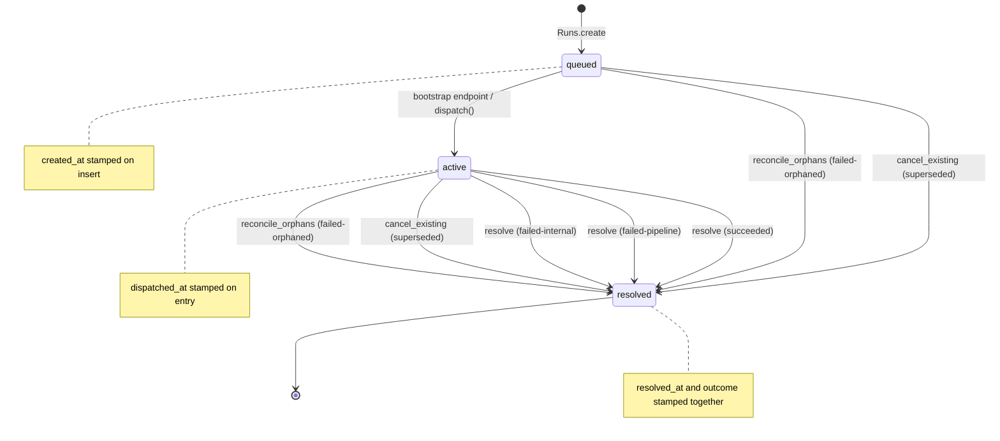
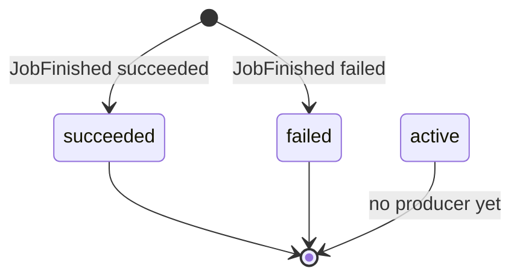
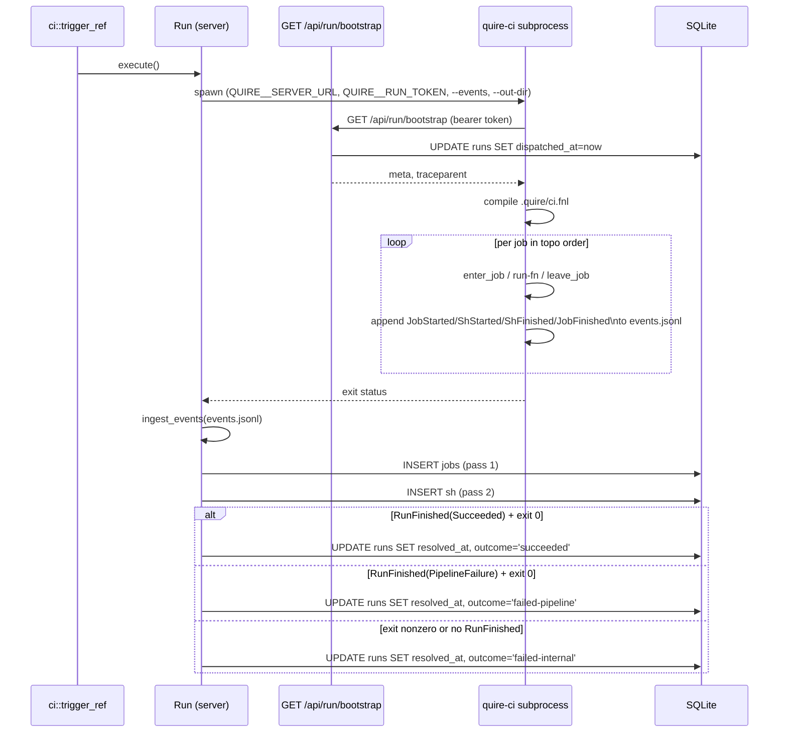

# quire — CI state machines

A reader's guide to the two state machines that govern a CI run, paired with what the code actually writes today vs. what the schema and `CI.md` describe. `CI.md` is the architectural design; this doc is the lifecycle inside that design.

There are two machines:

1. **Run state** — the row in `runs`. One per `(repo, ref, push)`.
2. **Job state** — the row in `jobs`. One per job inside a run.

A run owns its jobs; jobs FK on `(run_id, job_id)` and cascade delete.

## Run state machine

Since migration 0010 there is no `state` column. A run's lifecycle stage is **derived from two timestamps**, and terminal runs carry an **`outcome`** string:

| Stage | `dispatched_at` | `resolved_at` | `outcome` |
| --- | --- | --- | --- |
| queued | NULL | NULL | NULL |
| active | set | NULL | NULL |
| resolved | (any) | set | set |

### Diagram


```mermaid
stateDiagram-v2
    [*] --> queued : Runs.create

    queued  --> active   : bootstrap endpoint / dispatch()
    queued  --> resolved : cancel_existing (superseded)
    queued  --> resolved : reconcile_orphans (failed-orphaned)

    active  --> resolved : resolve (succeeded)
    active  --> resolved : resolve (failed-pipeline)
    active  --> resolved : resolve (failed-internal)
    active  --> resolved : cancel_existing (superseded)
    active  --> resolved : reconcile_orphans (failed-orphaned)

    resolved --> [*]

    note right of queued
      created_at stamped on insert
    end note

    note right of active
      dispatched_at stamped on entry
    end note

    note right of resolved
      resolved_at and outcome stamped together
    end note
```

### Transitions in code

| Transition | Where | When | `outcome` |
| --- | --- | --- | --- |
| `[*] → queued` | `Runs::create` (`quire-server/src/ci/run.rs`) | A push event arrives and a `runs` row is inserted. Stamps `created_at`. | — |
| `queued → active` | Bootstrap endpoint (`api.rs`) for API runs; `Run::dispatch` for local runs | `quire-ci` connects to the server and fetches the bootstrap payload. Stamps `dispatched_at`. | — |
| `active → resolved` | `Run::resolve`, called from `Run::execute` | `quire-ci` exited 0 and `RunFinished { outcome: Succeeded }` was ingested. | `succeeded` |
| `active → resolved` | `Run::execute` | `quire-ci` exited 0 and `RunFinished { outcome: PipelineFailure }` was ingested — a job's run-fn returned an error. Compile errors in `ci.fnl` also take this path (quire-ci emits `RunFinished(PipelineFailure)` and exits 0). | `failed-pipeline` |
| `active → resolved` | `Run::execute` | `quire-ci` exited non-zero, or exited 0 but emitted no `RunFinished` event (process crash or panic). | `failed-internal` |
| `{queued, active} → resolved` | `Runs::cancel_existing` | A new `Runs::create` for the same `(repo, ref)` arrived. Both queued and active rows are resolved directly. | `superseded` |
| `{queued, active} → resolved` | `reconcile_orphans` | Startup-time cleanup of rows left behind by a previous `quire serve` instance (`WHERE resolved_at IS NULL`). | `failed-orphaned` |

There is no typed allowed-transition table anymore. The guards are:

* `Run::dispatch` and `Run::resolve` reject re-entry via in-memory flags (`AlreadyDispatched`, `AlreadyResolved`).
* Every `UPDATE` stamps `dispatched_at`, `resolved_at`, and `outcome` through `COALESCE`, so each is written at most once — a later writer can never overwrite an earlier stamp.
* The DB `CHECK` constraints below reject inconsistent rows outright.

### Database invariants

Enforced by `CHECK` constraints (see `migrations/0010_outcome_schema.sql`):

* `(resolved_at IS NULL) = (outcome IS NULL)` — resolution and outcome arrive together.
* `outcome IN ('succeeded', 'failed-pipeline', 'failed-orphaned', 'failed-internal', 'superseded')`.
* Monotonicity: `dispatched_at >= created_at`, `resolved_at >= created_at`, and `resolved_at >= dispatched_at` when both are set.

A queued run superseded before dispatch resolves with `dispatched_at` still NULL — `superseded` and `failed-orphaned` do not require the run to have started.

### Outcomes

| Value | Producer |
| --- | --- |
| `succeeded` | `Run::execute`: exit 0 + `RunFinished(Succeeded)`. |
| `failed-pipeline` | `Run::execute`: exit 0 + `RunFinished(PipelineFailure)` — a job's run-fn returned an error, or `ci.fnl` failed to compile. |
| `failed-internal` | `Run::execute`: non-zero exit, or exit 0 with no `RunFinished` event (panic or unexpected termination). |
| `failed-orphaned` | `reconcile_orphans` on startup. |
| `superseded` | `Runs::cancel_existing` when a newer push to the same `(repo, ref)` displaces the run. Slated for renaming to `replaced` (see [`plans/2026-08-12-ci-rearchitecture.md`](./plans/2026-08-12-ci-rearchitecture.md), decision 7). |

The set is open — UI consumers should not assume it's exhaustive.

## Job state machine

### Diagram


```mermaid
stateDiagram-v2
    [*] --> succeeded : JobFinished succeeded
    [*] --> failed    : JobFinished failed

    succeeded --> [*]
    failed    --> [*]

    active --> [*] : no producer yet
```

### Transitions in code

There is only one writer of `jobs` rows: `Run::ingest_events`. It reads `events.jsonl` after the `quire-ci` subprocess exits and, for each `JobStarted`/`JobFinished` pair, inserts **one row directly in the terminal state**. The intermediate `active` state is held in an in-memory `inflight_jobs` map during ingest and never persisted.

| From → To | Where | When |
| --- | --- | --- |
| `[*] → succeeded` | `Run::ingest_events` | `JobFinished { outcome: succeeded }` paired with a buffered `JobStarted`. |
| `[*] → failed` | `Run::ingest_events` | `JobFinished { outcome: failed }` paired with a buffered `JobStarted`. |

Consequence: while `quire-ci` is running, **no `jobs` rows exist for this run**. They all materialize at ingest time. Live progress is visible via `events.jsonl` or per-`sh` log files on disk, not via SQL.

### Database invariants

`migrations/0009_rename_ci_vocab.sql` allows three job states (`active`, `succeeded`, `failed`) with these shape rules:

| State | `started_at_ms` | `finished_at_ms` |
| --- | --- | --- |
| `active` | set | NULL |
| `succeeded` | set | set |
| `failed` | set | set |

### Stop-on-first-failure inside `quire-ci`

The subprocess's executor (`quire-ci/src/main.rs`) breaks out of the topo-order loop on the first job error:

```rust
if let Err(e) = result {
    failed_job = Some((job_id.clone(), e));
    break;
}
```

`JobStarted`/`JobFinished` are only emitted for jobs that actually ran. **Jobs downstream of the failure produce no events, so no `jobs` row at all.** See Gaps below.

## Event flow: Process executor

`Executor::Process` is the only executor today. The orchestrator shells out to the `quire-ci` binary and ingests events afterward, rather than driving the runtime in-process:


```mermaid
sequenceDiagram
    participant Trigger as ci::trigger_ref
    participant Run as Run (server)
    participant Bootstrap as GET /api/run/bootstrap
    participant CI as quire-ci subprocess
    participant DB as SQLite

    Trigger->>Run: execute()
    Run->>CI: spawn (QUIRE__SERVER_URL, QUIRE__RUN_TOKEN, --events, --out-dir)
    CI->>Bootstrap: GET /api/run/bootstrap (bearer token)
    Bootstrap->>DB: UPDATE runs SET dispatched_at=now
    Bootstrap-->>CI: meta, traceparent
    CI->>CI: compile .quire/ci.fnl
    loop per job in topo order
      CI->>CI: enter_job / run-fn / leave_job
      CI->>CI: append JobStarted/ShStarted/ShFinished/JobFinished\nto events.jsonl
    end
    CI-->>Run: exit status
    Run->>Run: ingest_events(events.jsonl)
    Run->>DB: INSERT jobs (pass 1)
    Run->>DB: INSERT sh (pass 2)
    alt RunFinished(Succeeded) + exit 0
        Run->>DB: UPDATE runs SET resolved_at, outcome='succeeded'
    else RunFinished(PipelineFailure) + exit 0
        Run->>DB: UPDATE runs SET resolved_at, outcome='failed-pipeline'
    else exit nonzero or no RunFinished
        Run->>DB: UPDATE runs SET resolved_at, outcome='failed-internal'
    end
```

Wire events (`quire-core/src/ci/event.rs`):

* `JobStarted { job_id }`
* `JobFinished { job_id, outcome: succeeded | failed }` — `JobOutcome` is the closed set, not the full job-state enum.
* `ShStarted { job_id, cmd }` / `ShFinished { job_id, exit_code }`
* `RunFinished { outcome: succeeded | pipeline-failure }`

`Run::ingest_events` reads the file in two passes (jobs first to satisfy the FK on `(run_id, job_id)`, then sh). Ingest failures are logged but never demote the run's own outcome — a partial DB write is preferable to losing the pass/fail signal.

## Orchestration today

The lifecycle from push to run start:

```mermaid
sequenceDiagram
    participant Hook as post-receive
    participant Listener as event_listener (tokio)
    participant Trigger as ci::trigger
    participant Exec as Run::execute
    participant FS as filesystem
    participant DB as SQLite

    Hook->>Listener: PushEvent JSON over /var/quire/server.sock
    Listener->>Trigger: trigger(quire, &event)
    loop per updated ref
      Trigger->>DB: cancel_existing (queued|active → superseded for same repo/ref)
      Trigger->>DB: INSERT runs (created_at)
      Trigger->>FS: create run dir + workspace
      Trigger->>FS: git archive | tar -x  (materialize workspace)
      Trigger->>Exec: execute()
      Exec->>DB: dispatched_at via bootstrap endpoint; resolved_at + outcome after ingest
    end
```

Two things in `CI.md` that the code does *not* yet implement at this layer (both are decided targets in [`plans/2026-08-12-ci-rearchitecture.md`](./plans/2026-08-12-ci-rearchitecture.md)):

* **Queue + Notify wakeup.** `CI.md` describes a separate runner task pulled from a SQLite queue via `tokio::sync::Notify`. Today `ci::trigger` is called **synchronously** on the listener's tokio task — one push at a time, no queue, no separate runner. Max-concurrency-1 falls out of this trivially, but it isn't the architecture in `CI.md`.
* **Per-run container.** `CI.md` says `docker run` at run start and container teardown at run end. Today `quire-ci` runs as a host subprocess and invokes `(sh …)` directly on the host. The Docker-executor schema columns (`container_id`, `image_tag`, build/container timestamps) were removed in migration 0007.

## Schema column inventory

### `runs` table

| Column | Written by | Read by |
| --- | --- | --- |
| `id` | `Runs::create` | everywhere |
| `repo` | `Runs::create` | `cancel_existing`, web handlers |
| `ref_name` | `Runs::create` | `cancel_existing`, web handlers, bootstrap response |
| `sha` | `Runs::create` | `read_meta`, bootstrap response, web handlers |
| `pushed_at_ms` | `Runs::create` | `read_meta`, web handlers |
| `created_at` | `Runs::create` | web handlers |
| `dispatched_at` | bootstrap endpoint / `Run::dispatch`, also stamped as fallback by `cancel_existing` (active rows), `reconcile_orphans`, and `resolve` | `read_dispatched_at`, web handlers |
| `resolved_at` | `Run::resolve`, `cancel_existing`, `reconcile_orphans` | `read_resolved_at`, web handlers |
| `outcome` | `Run::resolve`, `cancel_existing`, `reconcile_orphans` | `read_outcome`, web handlers |
| `run_token` | `Runs::create` (API sessions only) | `verify_run_token` middleware |
| `traceparent` | `Run::store_bootstrap_data` (API sessions only) | bootstrap endpoint |

Migration 0007 dropped eight columns that carried no live data with the Process executor: `container_id`, `workspace_path`, `image_tag`, `build_started_at_ms`, `build_finished_at_ms`, `container_started_at_ms`, `container_stopped_at_ms`, and `sentry_trace_id`. Migration 0010 replaced `state`/`failure_kind` with the derived-lifecycle columns above. Migration 0011 dropped `git_dir`, whose only consumer was the CI mirror helper removed in favor of server-side mirroring.

### `jobs` table

All six columns (`run_id`, `job_id`, `state`, `exit_code`, `started_at_ms`, `finished_at_ms`) are written by `Run::ingest_events` and read by the web detail view. All live.

The schema permits three states (`active`, `succeeded`, `failed`) but `ingest_events` only writes `succeeded` and `failed`. `active` has no producer today — see Gaps below.

### `sh` table

All columns (`run_id`, `job_id`, `started_at_ms`, `finished_at_ms`, `exit_code`, `cmd`) are written by `Run::ingest_events` (pass 2) and read by the web detail view. All live.

## Gaps

States the schema admits — or `CI.md` commits to — that no code path produces today:

| Gap | Schema/spec | Producer needed |
| --- | --- | --- |
| Job `active` rows during execution | Schema-allowed | `ingest_events` inserts one row per job at JobFinished time. While `quire-ci` is running, the `jobs` table has nothing for this run. Live UI of "currently running job" needs an active-row writer — either eager ingest, or a separate writer inside `quire-ci`. |
| Job `skipped` outcome for dependents of a failed job | Tracked in ranger `wwpxzuvq` | `quire-ci`'s loop `break`s on first failure and emits no events for downstream jobs. Would need `skipped` re-added to the jobs CHECK constraint; producer would emit `JobSkipped` events from `quire-ci` or compute them in the ingester from the pipeline graph. |
| `:allow-failure` job flag | Documented in `CI.md` as v1 | Not implemented anywhere in `quire-core`, `quire-ci`, or `quire-server`. The structural validator doesn't recognize the key; the executor treats every job error as fatal. |
| Queue + Notify wakeup | `CI.md` "Communication" section | `trigger` runs synchronously on the listener task. No queue scan, no Notify, no separate runner task. Decided design in `plans/2026-08-12-ci-rearchitecture.md`, decision 5. |

## Cross-references

* Architecture and rationale: [`CI.md`](./CI.md).
* Where the implementation is headed: [`plans/2026-08-12-ci-rearchitecture.md`](./plans/2026-08-12-ci-rearchitecture.md).
* Pipeline DSL: [`CI-FENNEL.md`](./CI-FENNEL.md).
* DB shape: [`quire-server/migrations/`](../quire-server/migrations/), especially `0009_rename_ci_vocab.sql` (jobs) and `0010_outcome_schema.sql` (runs).
* Code: `quire-server/src/ci/run.rs`, `quire-server/src/ci/mod.rs`, `quire-core/src/ci/event.rs`, `quire-ci/src/main.rs`.
