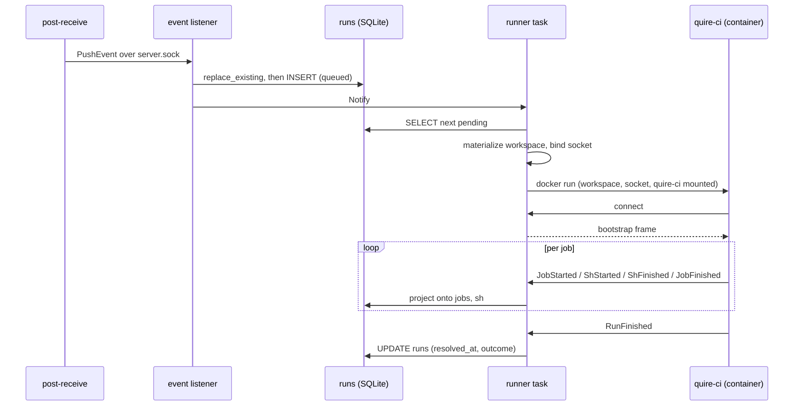

# CI re-architecture

Supersedes the transport half of
[`2026-05-14-quire-ci-server-api-design.md`](./2026-05-14-quire-ci-server-api-design.md)
and [`2026-05-23-quire-ci-events-endpoint.md`](./2026-05-23-quire-ci-events-endpoint.md).
Those documents chose HTTP for quire-ci ↔ quire-server communication; this
one replaces that choice with a per-run Unix socket, finishes the container
split those documents were groundwork for, and settles four adjacent
questions that were blocking it.

## Scope

In scope:

- Where `quire-ci` runs, and who launches it.
- How `quire-ci` and `quire-server` communicate.
- Running the same pipeline locally, with and without Docker.
- The server-side run queue.
- Removing mirroring from CI.
- Renaming the `superseded` run outcome.

Out of scope:

- Multi-job DAG scheduling. Jobs still run serially in topological order.
- Sandboxing the Lua VM (`lsqluktu`, `rzsonvsx`). Containerization is not a
  substitute, and the two are independent.
- Remote runners on a second host.
- Per-job container differentiation. The container is per-run.

## Background

`quire-server` spawns `quire-ci` as a host subprocess and the two halves
communicate through a shared run directory. Bootstrap and secrets already
moved to HTTP; events and logs did not. `quire-ci` writes `events.jsonl` and
`jobs/<job>/sh-N.log`, and the server ingests the event file after the
subprocess exits.

Two consequences follow. Nothing is live: `jobs` rows materialize only at
ingest time, so while a run executes the database holds nothing about it and
the web view cannot show progress. And nothing is isolated: `(sh …)` runs
directly on the host, so a pipeline has whatever access the server has.

The container work that would fix both was stage 3 of
[`2026-05-08-workspace-split.md`](./2026-05-08-workspace-split.md) and never
shipped. quire-ci is therefore paying the full cost of being a separate
binary — a bootstrap handshake, token auth, a wire format — while running in
the same place the server does.

## Decisions

### 1. Keep two binaries

The split stays. Its original justification holds: `quire-ci` runs inside the
run container, which is what makes a separate Docker executor unnecessary —
`(sh …)` is always local to wherever `quire-ci` already is.

Three properties depend on the split:

- The run container gets `quire-ci` as a bind-mounted static binary. The
  alternative is requiring every CI image to derive from a quire base image,
  which forfeits "any image from Docker Hub." A merged binary would put axum,
  rusqlite, and the migrations inside that mount.
- `quire-ci` cannot reach the database. The comms channel is the only way in,
  structurally rather than by convention.
- Local runs need a binary installable without a server, database, or config.

The change this forces: `quire-ci` needs a static (musl) build, installed at a
known host path so the launcher can mount it.

### 2. Docker is a launcher axis, not a code path

`quire-ci` never learns whether it is containerized. Same binary, same
bootstrap, same events, and `(sh …)` is always a local subprocess. Where it
runs is decided entirely by its launcher:

| Mode | Launcher | quire-ci runs in |
|---|---|---|
| Local, native | the user, directly | the user's shell |
| Local, Docker | `quire-ci run --docker`, re-execing itself | a container |
| Server | `quire-server` | a container |

`--docker` recurses exactly one level and terminates, because the inner
invocation does not carry the flag. The server builds the same `docker run`
argv directly rather than going through a host-side `quire-ci`, because it
needs the container ID for replacement and cleanup.

The argv builder lives in `quire-core` and both callers share it.
`Executor::Process` is deleted; the axis becomes `Launcher::{Native, Docker}`.

### 3. The pipeline image moves to `.quire/config.fnl`

`(ci.image …)` cannot survive containerization. The declaration lives in the
file `quire-ci` compiles, and `quire-ci` runs inside the container that
declaration is supposed to start.

Reading the image from `.quire/config.fnl` resolves this. The server already
reads that file with `git show` at the pushed SHA, without materializing a
workspace, so container startup stays single-phase.

The alternative — compiling `ci.fnl` host-side to learn the image — means
pipeline top-level code executes unsandboxed on the host on every run, which
would quietly undo the isolation containerization is meant to buy.

### 4. Communicate over a per-run Unix socket

The server creates one socket per run and bind-mounts it into that run's
container. Frames are JSON Lines in both directions. quire-ci → server reuses
`quire_core::ci::event::Event` unchanged. server → quire-ci carries a small
`Command` enum: bootstrap on connect, secret responses, and cancel.

This is a change of one `EventSink` implementation, not of the architecture.
Local runs need a sink with no server behind it regardless, so the trait stays
either way, and the decision is reversible.

Against the HTTP design it replaces:

- Authentication disappears. Holding the socket is the capability. No run
  token, no bearer middleware, no 401 or 403.
- The channel is bidirectional, which run replacement needs. Over HTTP,
  stopping a running job means `docker kill` with no cleanup, or polling.
- Retry policy, backoff, and 5xx handling disappear. A local socket has no
  transient failures; if it breaks, the run is broken.
- Logs and events multiplex over one connection. The chunked-POST log design
  (`wzmkkkon`) becomes another frame type.
- EOF is a much better liveness signal than HTTP silence, so the watchdog
  gets simpler.

The cost is that a runner on a second host would need a socket-to-HTTP
bridge. That is a deliberate trade: a single-user forge on one box is the
design center, and the bridge is a small proxy if it is ever needed.

Timing decided this. What ships today is two GET endpoints and token
middleware, all cheap to delete. What remains unshipped on the HTTP path is
the events endpoint, chunked log streaming, and the watchdog — most of the
work. Switching now is cheap; switching after log streaming lands is not.

### 5. The server gets a real queue

`ci::trigger` currently runs synchronously on the socket listener's task.
Max-concurrency-1 is an accident of that structure rather than a decision.

The database is already shaped for a queue: `runs_pending` indexes
`created_at WHERE outcome IS NULL`. The listener inserts a row and fires a
`Notify`; a runner task waits on it and selects the next pending run.
Wakeups carry no payload, so missed or duplicated notifications are
idempotent. Concurrency becomes a semaphore rather than a structural
property.

One existing behavior becomes a bug under a queue. `reconcile_orphans`
(`quire-server/src/ci/run.rs:159`) resolves every unfinished run at startup:

```sql
WHERE resolved_at IS NULL
```

A queued run that was never dispatched should return to the queue, not be
marked `failed-orphaned`. Genuine orphans are `dispatched_at IS NOT NULL AND
resolved_at IS NULL`.

### 6. Mirroring leaves CI

`quire-server/src/bin/quire/server.rs:159-160` calls `ci::trigger` and
`mirror::trigger` on every push event. Server-side mirroring already runs
unconditionally, so a pipeline calling `(mirror …)` pushes the same refs a
second time. The CI path is a duplicate, not a mechanism.

Removed:

- `M.mirror` in `quire-core/src/ci/stdlib.fnl` and the `runtime.mirror`
  primitive, with their tests.
- The `git-dir` field on the `quire/push` source table
  (`quire-core/src/ci/runtime.rs:158-161`). Mirroring was its only consumer.
- `Bootstrap.git_dir`.

Dropping `Bootstrap.git_dir` is what makes containerization cheap: the run
container needs the workspace mounted and nothing else, with no bare repo
crossing the boundary. quire-ci's other use of `git_dir` — deriving SHA and
ref from `HEAD` in local mode — is host-side by definition, and `--git-dir`
stays as a local-only flag.

One capability is lost. The CI mirror gated on per-target `:refs`; the
server's `mirrors` map is URL to secret name with no filter. Tracked as
`yqurmtmp`.

### 7. Rename `superseded` to `replaced`

The outcome recorded when a newer push to the same `(repo, ref)` displaces a
run is called `superseded`. It is hard to read and hard to spell, and it has
already been renamed once — migration 0009 called it `canceled`, and 0010
renamed it.

`replaced` says what happened, and it leaves `canceled` free for
operator-initiated cancellation. That distinction is about to matter:
cancellation is on the backlog next to manual retrigger (`zwpolpnm`), and
decision 4 makes it cheap to build. Reusing `canceled` would collide the two
concepts in one word.

Touches `outcome = 'replaced'`, `Runs::cancel_existing` → `replace_existing`,
display strings in `web/format.rs`, seed data in `commands/dev.rs`, and
CI.md's "Supersede semantics" section. Migrations 0001 through 0010 are
append-only and stay as written; 0011 rebuilds the table the way 0010 already
did, because the value lives in a `CHECK` constraint.

Worth folding into the same migration: a nullable `replaced_by` column
holding the new run's ID. `replace_existing` already knows the incoming run,
so it costs nothing at write time, and it turns a dead-end run page into
"replaced by run abc123."

## Resulting flow



## Backlog

The `ready` queue carries this design in implementation order:

| Key | Task |
|---|---|
| `xvtxxmoz` | Remove mirroring from CI |
| `pkpkursx` | Move the pipeline image declaration to `.quire/config.fnl` |
| `sxxrppsm` | Rename the superseded run outcome to replaced |
| `psuumwvs` | Add a server-side run queue |
| `llrqwovp` | Replace the HTTP transport with a per-run Unix socket |
| `kmosnxux` | Build quire-ci as a static binary |
| `qtkupwzn` | Launch quire-ci in a container |
| `mrkstomp` | Add a run watchdog for authoritative termination |
| `stzvqrwp` | Retire the filesystem comms path |
| `lylszxrn` | Reconcile container orphans on quire startup |
| `zmtuqwly` | Detect container-died as a distinct failure mode |
| `uvwnkwmx` | Prune old quire-ci images and run workspaces |
| `zsykowzk` | Add a terminal sink for local quire-ci runs |

Archived: `wzmkkkon` (chunked log POST) and `xkyuzkoz` (resolve image from
`(ci.image …)`), whose reasons to exist are removed by decisions 4 and 3.
`yqurmtmp` recovers the ref filter decision 6 drops.

## Documentation debt

`docs/CI-STATE.md` documents the pre-0010 schema throughout — `state` and
`failure_kind`, their diagrams, transition tables, and invariants. Migration
0010 replaced all of it with `created_at`, `dispatched_at`, `resolved_at`,
and an `outcome` enum. It needs rewriting against this design rather than
patching.

`docs/CI.md` presents per-run Docker containers, the queue, and
`:allow-failure` as locked-in v1 decisions. The first two become true under
this document. `:allow-failure` remains unimplemented and should be marked as
such.

## Open questions

- **Watchdog timeout.** Long enough for a slow `npm install`, short enough
  that a wedged container does not strand a run. Needs a number.
- **Log frame granularity.** One frame per line is simplest and a local
  socket handles the volume. Whether chatty pipelines justify batching is a
  measurement, not a design question.
- **Cache mounts.** `CI.md` commits to bind-mounted directories under
  `/var/quire/cache/<repo>/`. Local Docker runs need an answer too, and it
  probably should not be the same directory.
- **Local run identity.** A local run has no run ID and no database. Whether
  `quire-ci run` should be able to report into a server at all, or stay
  strictly offline, is unresolved.
